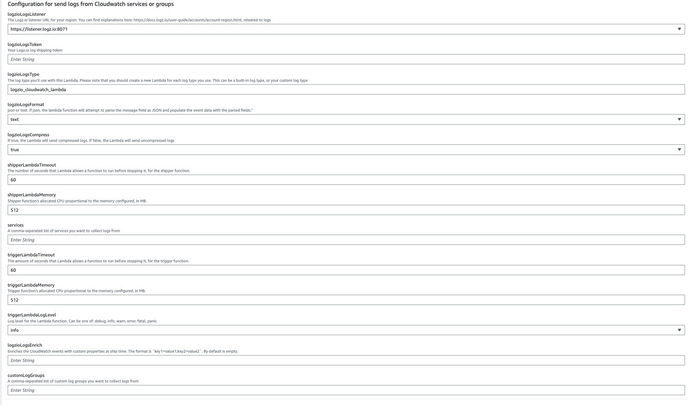
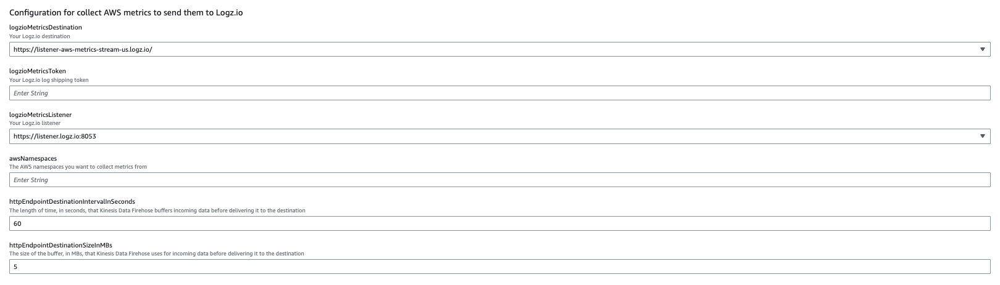

# Ship Logs and Metrics

This CloudFormation template allows shipping AWS Logs and Metrics to logz.io.

It will deploy the following projects:
- AWS metrics to Logzio (See here the function's repo)[https://github.com/logzio/cloudwatch-metrics-helpers].
- AWS logs to Logz.io (See here the function's repo)[https://github.com/logzio/cloudwatch-shipper-trigger].

## Instructions

To deploy this integrion, click the button that matches the region you wish to deploy your Stack to:

| Region           | Deployment                                                                                                                                                                                                                                                                                                                                             |
|------------------|--------------------------------------------------------------------------------------------------------------------------------------------------------------------------------------------------------------------------------------------------------------------------------------------------------------------------------------------------------|
| `us-east-1`      |            | 
| `us-east-2`      |            | 
| `us-west-1`      |            | 
| `us-west-2`      |            | 
| `eu-central-1`   |      | 
| `eu-north-1`     |          | 
| `eu-west-1`      |            | 
| `eu-west-2`      |            | 
| `eu-west-3`      |            | 
| `sa-east-1`      |            | 
| `ap-northeast-1` |  | 
| `ap-northeast-2` |  | 
| `ap-northeast-3` |  | 
| `ap-south-1`     |          | 
| `ap-southeast-1` |  | 
| `ap-southeast-2` |  | 
| `ca-central-1`   |      |

## Logs integration

This project will create 2 Lambda functions:

- **Shipper function**: this function is responsible for processing and shipping the Cloudwatch logs to Logz.io. [See here the function's repo](https://github.com/logzio/logzio_aws_serverless/tree/master/python3/cloudwatch).

- **Trigger function**: this function is responsible for adding subscription filters to the desired Cloudwatch log groups, to trigger the shipper function.

When the Trigger function is run for the first time, it will add subscription filters to the log groups chosen by the user. If the user chose a service, the Trigger function will also get triggered whenever a log group is created to check if this log group is for a service that is one of the services that the user has selected. If yes, it will add a subscription filter to it.

#### Shipper config:

| Parameter              | Description                                                                                                                                                                                                                             | Required/Default                  |
|------------------------|-----------------------------------------------------------------------------------------------------------------------------------------------------------------------------------------------------------------------------------------|-----------------------------------|
| `logzioLogsToken`          | Replace `<<SHIPPING-TOKEN>>` with the [token](https://app.logz.io/#/dashboard/settings/general) of the account you want to ship to.                                                                                                     | **Required**                      |
| `logzioLogsListener`       | Listener host, and port (for example, `https://<<LISTENER-HOST>>:8071`).                                                                                                                                                                | **Required**                      |
| `logzioLogsType`           | The log type you'll use with this Lambda. This can be a [built-in log type](https://docs.logz.io/user-guide/log-shipping/built-in-log-types.html), or a custom log type.   You should create a new Lambda for each log type you use. | Default: `logzio_cloudwatch_logs` |
| `logzioLogsFormat`         | `json` or `text`. If `json`, the Lambda function will attempt to parse the message field as JSON and populate the event data with the parsed fields.                                                                                    | Default: `text`                   |
| `logzioLogsCompress`       | Set to `true` to compress logs before sending them. Set to `false` to send uncompressed logs.                                                                                                                                           | Default: `true`                   |
| `logzioLogsEnrich`         | Enrich CloudWatch events with custom properties, formatted as `key1=value1;key2=value2`.                                                                                                                                                | -                                 |
| `shipperLambdaTimeout` | The number of seconds that Lambda allows a function to run before stopping it, for the shipper function.                                                                                                                                | Default: `60`                     |
| `shipperLambdaMemory`  | Shipper function's allocated CPU proportional to the memory configured, in MB.                                                                                                                                                          | `512`                             |

#### Trigger config:

| Parameter               | Description                                                                                                                                                                                                                                              | Required/Default |
|-------------------------|----------------------------------------------------------------------------------------------------------------------------------------------------------------------------------------------------------------------------------------------------------|------------------|
| `services`              | A comma-seperated list of services you want to collect logs from. Supported options are: `apigateway`, `rds`, `cloudhsm`, `cloudtrail`, `codebuild`, `connect`, `elasticbeanstalk`, `ecs`, `eks`, `aws-glue`, `aws-iot`, `lambda`, `macie`, `amazon-mq`. | -                |
| `customLogGroups`       | A comma-seperated list of custom log groups you want to collect logs from                                                                                                                                                                                | -                |
| `triggerLambdaTimeout`  | The amount of seconds that Lambda allows a function to run before stopping it, for the trigger function.                                                                                                                                                 | `60`             |
| `triggerLambdaMemory`   | Trigger function's allocated CPU proportional to the memory configured, in MB.                                                                                                                                                                           | `512`            |
| `triggerLambdaLogLevel` | Log level for the Lambda function. Can be one of: `debug`, `info`, `warn`, `error`, `fatal`, `panic`                                                                                                                                                     | `info`           |

On image you can see a **Create Stack** page with relevant configuration, what you need to fill in.

##### ⚠️ Important note ⚠️

AWS limits every log group to have up to 2 subscription filters. If your chosen log group already has 2 subscription filters, the trigger function won't be able to add another one.

### 2. Send logs

Give the stack a few minutes to be deployed.

Once new logs are added to your chosen log group, they will be sent to your Logz.io account.

##### ⚠️ Important note ⚠️

If you've used the `services` field, you'll have to **wait 6 minutes** before creating new log groups for your chosen services. This is due to cold start and custom resource invocation, that can cause the cause Lambda to behave unexpectedly.

## Metrics integration

### 1. Specify stack details

Specify the stack details as per the table below, check the checkboxes and select **Create stack**.

| Parameter                                  | Description                                                                                                                                                                                                                                                                       | Required/Default |
|--------------------------------------------|-----------------------------------------------------------------------------------------------------------------------------------------------------------------------------------------------------------------------------------------------------------------------------------|------------------|
| `logzioMetricsListener`                           | The Logz.io listener URL for your region. (For more details, see the [regions page](https://docs.logz.io/user-guide/accounts/account-region.html). For example - `https://listener.logz.io:8053`                                                                                  | **Required**     |
| `logzioMetricsToken`                              | Your Logz.io metrics shipping token.                                                                                                                                                                                                                                              | **Required**     |
| `awsNamespaces`                            | Comma-separated list of the AWS namespaces you want to monitor. See [this list]((https://docs.aws.amazon.com/AmazonCloudWatch/latest/monitoring/aws-services-cloudwatch-metrics.html) of namespaces. If you want to automatically add all namespaces, use value `all-namespaces`. | **Required**     |
| `logzioMetricsDestination`                        | Your Logz.io destination URL.                                                                                                                                                                                                                                                     | **Required**     |
| `httpEndpointDestinationIntervalInSeconds` | The length of time, in seconds, that Kinesis Data Firehose buffers incoming data before delivering it to the destination.                                                                                                                                                         | `60`             |
| `httpEndpointDestinationSizeInMBs`         | The size of the buffer, in MBs, that Kinesis Data Firehose uses for incoming data before delivering it to the destination.                                                                                                                                                        | `5`              |

On image you can see a **Create Stack** page with relevant configuration, what you need to fill in.

### 2. Send your metrics

Give your Cloudformation a few minutes to be created, and that's it!